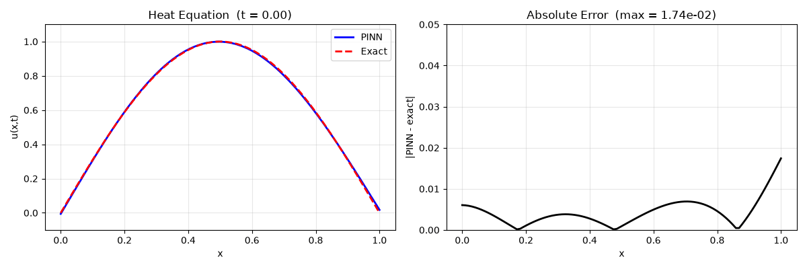

# PINNForge

**Solve partial differential equations in 3 lines of code.**



PINNForge is a lightweight wrapper around PyTorch that handles the boilerplate of Physics-Informed Neural Networks so you can focus on the physics.

## Install

```bash
pip install pinnforge
```

## Quick Start

```python
from pinnforge import solve_pde

result = solve_pde("heat", epochs=5000)
print(f"Relative L2 error: {result['metrics']['relative_l2_error']:.2e}")
# Relative L2 error: 3.42e-02
```

That's it. The library automatically builds the network, generates training points, trains, validates, and returns metrics.

## Why PINNForge?

Setting up a PINN in the standard tooling requires 25+ lines of boilerplate before you see your first result. PINNForge gets you there in 3.

### Side-by-side: solving the 1D Heat equation

<table>
<tr>
<th width="50%">PINNForge (3 lines)</th>
<th width="50%">DeepXDE (~25 lines)</th>
</tr>
<tr>
<td>

```python
from pinnforge import solve_pde

result = solve_pde("heat", epochs=5000)
print(result['metrics']['relative_l2_error'])
```

That's the whole program. Everything else is handled by the library.

</td>
<td>

```python
import deepxde as dde
import numpy as np

def pde(x, y):
    dy_t = dde.grad.jacobian(y, x, i=0, j=1)
    dy_xx = dde.grad.hessian(y, x, i=0, j=0)
    return dy_t - dy_xx

geom = dde.geometry.Interval(0, 1)
timedomain = dde.geometry.TimeDomain(0, 1)
geomtime = dde.geometry.GeometryXTime(geom, timedomain)

def boundary(x, on_boundary):
    return on_boundary

def initial(x):
    return np.sin(np.pi * x[:, 0:1])

bc = dde.icbc.DirichletBC(geomtime, lambda x: 0, boundary)
ic = dde.icbc.IC(geomtime, initial, lambda _, on_initial: on_initial)

data = dde.data.TimePDE(
    geomtime, pde, [bc, ic],
    num_domain=2000, num_boundary=100, num_initial=100,
)

net = dde.nn.FNN([2] + [64] * 3 + [1], "tanh", "Glorot normal")
model = dde.Model(data, net)
model.compile("adam", lr=1e-3)
model.train(epochs=15000)
model.compile("L-BFGS")
losshistory, train_state = model.train()

# Then write validation and plotting code yourself
```

The setup is 9x longer and you still need to write your own validation and plots after training.

</td>
</tr>
</table>

### Feature comparison

| Feature | PINNForge | DeepXDE | PINNs-Torch |
|---------|-----------|---------|-------------|
| One-line solve API | ✅ | ❌ | ❌ |
| Symbolic PDE definition (SymPy) | ✅ | ❌ | ❌ |
| Auto-generated validation metrics | ✅ | ❌ | ❌ |
| Auto-generated plots | ✅ | ❌ | ❌ |
| Sensible defaults per PDE | ✅ | ❌ | ❌ |
| Built-in numerical solvers | ✅ | ❌ | ❌ |
| Multi-backend (TF / JAX / PyTorch) | PyTorch only | ✅ | PyTorch |
| 3D+ problems | Limited | ✅ | Limited |
| Battle-tested since 2019 | ❌ (v0.1) | ✅ | ❌ |

**The trade-off is on purpose.** PINNForge trades depth for time-to-result. If you need complex PDEs or production-scale 3D problems, use DeepXDE. If you want to try an idea in 5 minutes with minimal code, use PINNForge.

## What's Included

- **`solve_pde()`** — one-line API for common PDEs (Heat, Burgers, Wave)
- **`AutoPINN`** — configurable solver with auto-selected hyperparameters
- **`PINN`** — the underlying neural network module
- **`SymbolicPDE`** — define custom PDEs using SymPy math notation
- **`NumericalSolver`** — finite-difference reference solutions
- **`ExperimentLogger`** — automatic logging of training metrics and checkpoints

## Custom PDEs with SymPy

For problems not in the built-in registry, define them symbolically:

```python
import sympy as sp
from pinnforge import AutoPINN

x, t, u = sp.symbols('x t u')
equation = sp.diff(u, t) + u * sp.diff(u, x) - 0.01 * sp.diff(u, x, 2)

solver = AutoPINN.from_symbolic(equation, [x, t], u)
result = solver.solve()
print(result['metrics'])
```

## Known Limitations (v0.1.0)

This is an early release. Here's what doesn't work yet:

- **Fourier feature embeddings are implemented but disabled by default.** They currently cause training collapse on test problems (error jumps from 1e-2 to 1.2). Help wanted — see [#3](https://github.com/ved-rl/pinnforge/issues/3).
- **Adaptive loss weighting is implemented but disabled by default.** Same reason.
- **Adaptive activation (SA-PINN) is disabled by default.** Interacts badly with Fourier features.
- **Burgers equation validation returns `{}`.** The analytical solution currently in the code is the Heat equation's solution, not Burgers'. Burgers has no simple closed-form solution for this initial condition. See [#4](https://github.com/ved-rl/pinnforge/issues/4).
- **Only 1D problems are supported.** Multi-dimensional PDEs are planned for v0.2.0.
- **No CLI yet.** Everything is Python-only.

## Contributing

This is a young project and there are several tasks that would help a lot. If you're looking for a place to contribute to SciML tooling, this project is a place where help is welcome.

### Good First Issues

| Task | Difficulty | Description |
|------|------------|-------------|
| **Fix Burgers analytical solution** | Easy | The `BurgersEquation.analytical_solution` method returns the Heat solution. Replace with `NotImplementedError` and fall back to the numerical solver. See [#4](https://github.com/ved-rl/pinnforge/issues/4). |
| **Add tests for Wave equation** | Easy | `WaveEquation` exists in `pdes.py` but has no test coverage. Add a basic smoke test to `tests/test_pdes.py`. |
| **Add a quickstart notebook** | Easy | Create `examples/quickstart.ipynb` that walks through the 3-line API and shows results inline. |
| **Improve error messages** | Easy | Several places raise generic errors. Add context-specific messages for common failure modes. |

### Larger Contributions Welcome

| Task | Difficulty | Description |
|------|------------|-------------|
| **Fix Fourier feature implementation** | Medium | Features collapse to a constant output. Current implementation uses only `output_dim // 2` random projections; standard RFF uses 128+. See [#3](https://github.com/ved-rl/pinnforge/issues/3). |
| **L-BFGS fine-tuning** | Medium | Adding L-BFGS as a second-stage optimizer (as DeepXDE does) would improve final accuracy by 10x. |
| **2D PDE support** | Hard | Currently limited to 1D spatial domains. Requires changes to `pdes.py`, `data.py`, and the `PINN` class. |
| **JAX backend** | Hard | Optional JAX backend for 5-10x faster training. See `jinns` for reference. |
| **Adaptive sampling (RAR)** | Medium | Residual-based adaptive refinement. Sample new collocation points where the PDE residual is highest. |

### How to Contribute

1. Fork the repo
2. Create a feature branch (`git checkout -b fix-fourier-features`)
3. Make your changes
4. Run `pytest tests/ -v` and make sure everything passes
5. Open a Pull Request

See `CONTRIBUTING.md` for the full guide. First-time contributors are very welcome — if you're unsure where to start, open an issue and ask.

## Tech Stack

- Python 3.8+
- PyTorch 
- SymPy
- NumPy / SciPy 

## License

MIT — see `LICENSE`.

## Acknowledgments

Built on the original Physics-Informed Neural Networks formulation by Raissi, Perikaris, and Karniadakis (2019). Inspired by the usability goals of DeepXDE but with a focus on time-to-first-result.